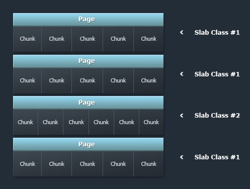

# memcache

<!-- toc -->

## 内存分配方式

memcache 采用块分配的方式存储数据，即事先将内存分配成各种尺寸的块，被称作chuck，存储数据时，选择最接近该数据大小的块（要大于数据大小）。

下图是memcache 内存分配的一个图：

memcache 分配内存的时候是以 page 为单位分配的，page 大小默认为 1M，可以通过 -I 方式指定页的大小。一个 page 会被分为多个 chunk，chunk是用来实际存储数据，每个页中chunk的大小是相同的，一个页中的多个chunk称为成为slab class。

对象的大小是不固定的，因此会有多种大小的chunk，chunk的起始大小是88个字节
